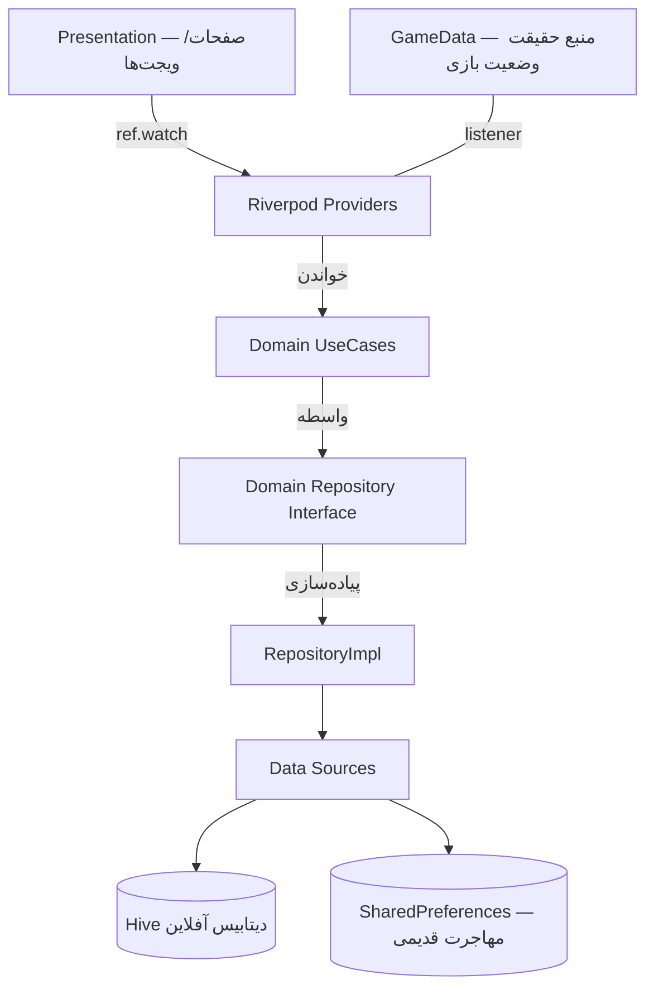

# 🏗️ معماری اپلیکیشن جزیره فندقی (Jazireh Fandoghi)

> به‌روزرسانی: فاز ۱۰ نقشه راه ۱۰۰ فازی (۹ اوت ۲۰۲۶)

## 📌 نمای کلی (Overview)
این پروژه از اصول **معماری پاک (Clean Architecture)** و **مدیریت وضعیت با Riverpod** پیروی می‌کند. هدف اصلی، جداسازی منطق بازی از رابط کاربری و مدیریت داده‌های آفلاین به صورت امن است.

## 📂 ساختار پوشه‌ها (Folder Structure)

```text
lib/
├── app/            # تنظیمات کلی اپ (تم، فونت، رنگ‌ها، ThemeController)
├── core/           # منطق مشترک (صدا، لاگر، GameData، AI، سکه/ستاره)
├── data/           # لایه داده
│   ├── datasources/# HivePlayerStore، CrashReportStore، LocalDataSource
│   └── repositories/# پیاده‌سازی ریپازیتوری‌ها
├── domain/         # لایه بیزینس (مستقل از فریم‌ورک)
│   ├── entities/   # PlayerProfile، GameStage
│   ├── repositories# تعریف ریپازیتوری‌ها (Interface)
│   └── usecases/   # GetPlayerProfile، RecordAnswer، CompleteStage، UpdateSettings
├── features/       # ویژگی‌های اپ (بخش‌بندی بر اساس قابلیت)
│   ├── games/      # انواع بازی‌ها
│   ├── home/       # داشبورد اصلی
│   └── ...
├── presentation/   # لایه ارائه
│   └── providers/  # gameStateProvider، playerProfileProvider، useCaseProviderها
└── shared/         # ویجت‌ها و ابزارهای مشترک UI
```

## 🧱 معماری لایه‌ای (فاز ۲)



## 🔄 جریان داده (Data Flow)
1. **Presentation** ورودی را از کاربر می‌گیرد و از طریق Provider به **UseCase** می‌دهد.
2. **UseCase** منطق خالص Domain را اجرا می‌کند (بدون دانش Flutter).
3. **Repository** داده را از **DataSource** (Hive اول، SharedPreferences قدیمی به‌عنوان Fallback) دریافت می‌کند.
4. داده‌ها به صورت **Entity** به لایه ارائه برمی‌گردند و `GameData.changes` شنونده‌های Riverpod را به‌روز می‌کند.

## 💾 ذخیره‌سازی (فاز ۴)
- **Hive** (`playerBox`): اسنپ‌شات نسخه‌دار (`state_v1` + `schema_version`) — منبع اصلی.
- **SharedPreferences**: برای سازگاری با نسخه‌های قدیمی (migration خودکار در اولین save).
- **CrashReportStore** (`crash_logs`): ۵۰ خطای آخر، کاملاً محلی.

## 🎨 تم داینامیک (فاز ۷)
- `ThemeController` بر اساس چرخه روز (صبح/ظهر/شب) + حالت سیستم + `textScale` والدین تم می‌سازد.
- هر ۱۵ دقیقه و هنگام بازگشت از پس‌زمینه به‌روزرسانی می‌شود.

## 🔒 حریم خصوصی و امنیت
تمام داده‌ها به صورت ۱۰۰٪ آفلاین ذخیره می‌شوند و هیچ اطلاعاتی از کودک به سرورهای خارجی ارسال نمی‌گردد. (ممیزی فاز ۶۳)

## 📄 مستندات مرتبط
- `docs/PHASE_EXECUTION_LOG.md` — وضعیت ۱۰۰ فاز
- `docs/PHASE_1_AUDIT.md` — بدهی فنی فاز ۱
- `AI_PROJECT_RULES.md` — قانون اساسی توسعه
- `ROADMAP_100_PHASE.md` — نقشه راه کامل
